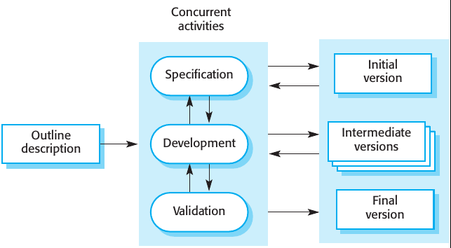
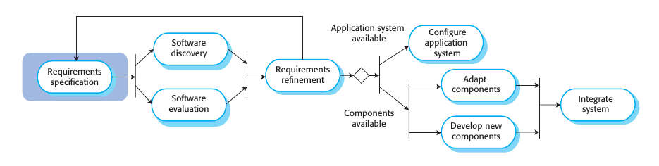
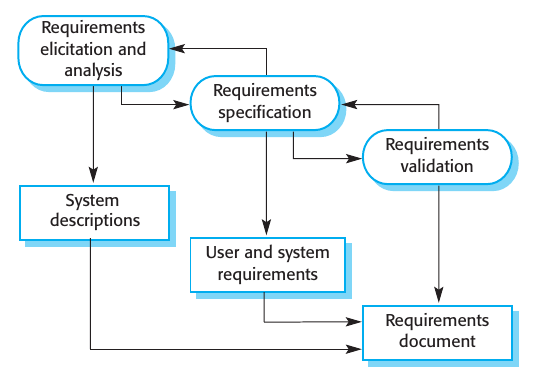
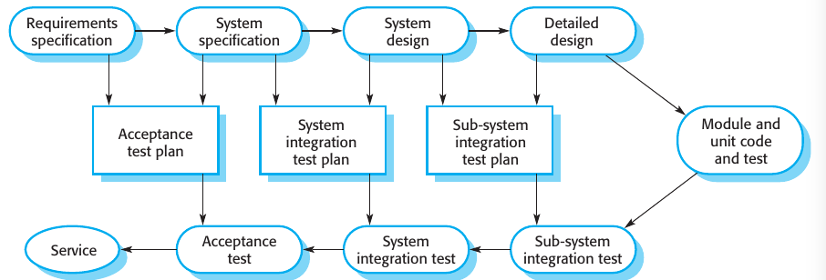
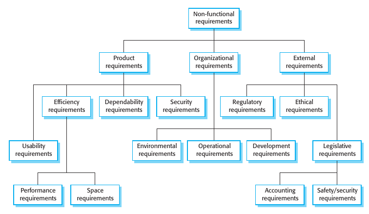
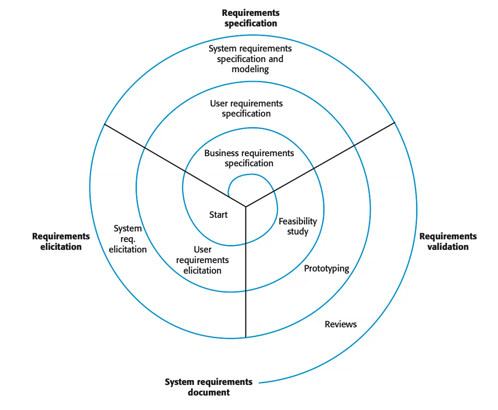
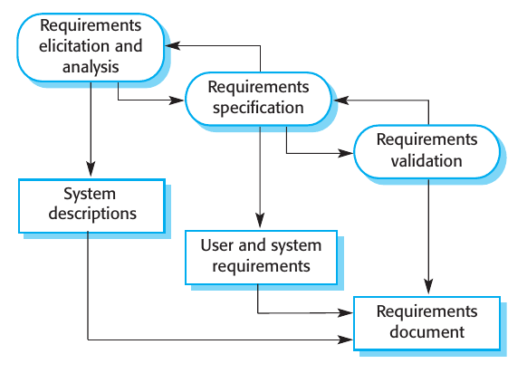
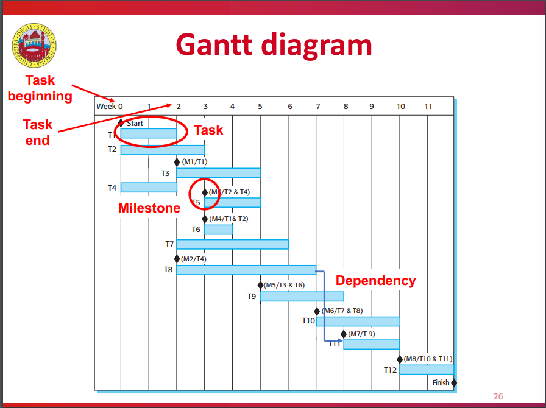
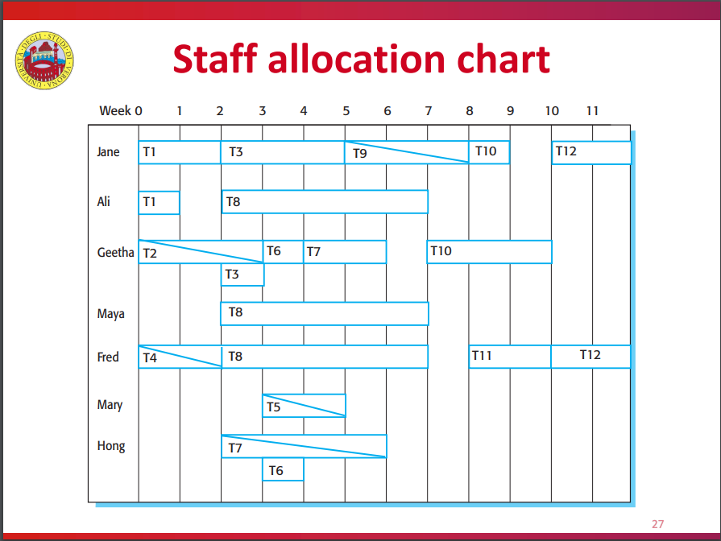
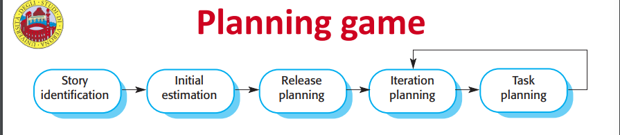

# Ingegneria del software
## 01 - Introduzione
Software molto importante al giorno d'oggi per economie e società. Addirittura le nazioni vi dipendono. Però non è **tangibile** quindi complesso e difficile da mantenere.

SW *engineering* porta **teoria**, **metodi** e **strumenti** per fare sviluppo SW in modo professionale. "Ingegneria" significa produrre prodotto della **qualità** richiesta (e non oltre) nei **tempi** e nei **budget** fissati. Accompagna il SW dalla nascita fino alla fine della manutenzione.

Costo sviluppo $<$ Costo manutenzione. SW engineering vuole essere cost-effective.

Report del 2017: solo 29% dei progetti hanno rispettato deadline e budget.

Problemi comuni:
- Progetto cancellato
- Fuori deadline
- Fuori budget
- Non tutte le feature
- SW bassa qualità
- Utenti insoddisfatti

Scuse:
- Complessità intrinseca del problema
- Ostacoli tecnologici

Vere ragioni:
- Dialogo stakeholder $\leftrightarrow$ sviluppatori
- Difficoltà capire problemi degli utenti
- Difficoltà capire dominio
- Problemi di management e organizzazione del lavoro
- Problemi team working

## 02 - Software Process
Processo SW = **Insieme strutturato di attività** da compiere per sviluppare un SW.

Per ogni attività si specificano:
- Descrizione
- Output
- Ruoli e responsabilità delle persone coinvolte
- Pre/Post-condizioni

Perché seguire un processo? Per rendere sviluppo:
- Ordinato
- Controllabile
- Ripetibile

Al fine di:
- Aumentare qualità SW (cioè **qualità processo si traduce in qualità prodotto**)
- Aumentare produttività

Vari processi ma tutti includono queste attività **standard**:
- Specifica
- Design & Implementazione
- Validazione
- Evoluzione

_Le attività_ di un processo vengono _pianificate_ secondo un mix di queste management techniques:
- Plan Driven: si pianifica tutto subito e poi si inizia il processo SW tracciando progresso
- Agile (SCRUM): si pianifica mano a mano che il processo prosegue. Più facile reagire a cambiamenti

Pianificazione delle attività $\neq$ Specifica del prodotto (cioè requisiti)

Vediamo alcuni _modelli_ di processi, ogni processo _reale_ prende aspetti da >1 di questi.

### Alcuni processi
Nel **Code & Fix** si va per tentativi. Nessuna fase di analisi o design, si va dritti all'implementazione. Alla fine si controlla se è ok altrimenti si fixa il codice e repeat. Non considerato un vero processo.

---

Il **Waterfall** è sempre **Plan Driven**. Specifica del prodotto e poi sviluppo, niente interlacciamento. Stampo industriale e manifatturiero. Output attività $i$ = Input attività $i+1$ e output freezati una volta all'attività $i+1$.

Le attività sono:
1. Raccolta e definizione requisiti
2. Design
3. Implementazione e test di ogni componente in isolamento
4. Integrazione e test dei componenti insieme.
5. Consegna al cliente e manutenzione.

Pros & Cons:
+ $+$ Enfasi su analisi requisiti e design fatti bene, implementazione lasciata per ultima
+ $+$ Disciplinato
+ $-$ Funziona solo se requisiti sono chiari e stabili
+ $-$ Difficile accomodare cambi ai requisiti. Visto che sono l'output della prima attività e tutti output sono freezati.

Buono per:
- Embedded, cambi al HW difficili e costosi
- Sistemi critici, serve tanta analisi e tutto documentato
- Organizzazioni grandi e complesse

---

**Sviluppo Incrementale** ha attività di specifica, sviluppo e validazione interlacciate. SW consegnato per incrementi. Pianificazione delle attività stesse può essere **Plan Driven oppure Agile**.

Pros & Cons:
- $+$ Costi ridotti per reagire ai cambiamenti
- $+$ Rapidissima consegna delle feature essenziali, cliente inizia subito ad usare il SW
- $+$ Maggiore feedback dagli stakeholder che usano subito il SW, requisiti per successivi incrementi saranno presi con maggiore consapevolezza
- $+$ Minore rischio di fallimento
- $-$ Difficile tracciare progresso (anche quando pianificazione è plan driven) perché si reagisce ai cambiamenti
- $-$ Costoso produrre continuamente documentazione
- $-$ Codice si sporca con il tempo e diventa sempre più costoso fare modifiche. Serve refactoring ogni tanto
- $-$ Specifica fatta poco per volta, in alcuni domini però deve fare parte del contratto iniziale
- $-$ Alcune funzionalità base sono usate da tanti componenti, ma questi ultimi saranno definiti molto più avanti nel tempo e non siamo sicuri che i componenti base (sviluppati subito) esporranno ad essi un interfaccia corretta

---

**Integrazione e Configurazione** = prendere, adattare, configurare e integrare componenti esistenti. Può essere **Plan Driven oppure Agile**.

Attività:
- Raccolta e specifica requisiti **essenziali**, **poco dettaglio**
- Ricerca e valutazione componenti
- Raffinamento requisiti alla luce dei componenti trovati. Se non è possibile modificare requisiti per essere compatibili con componenti trovati, se ne cercano altri (fase precedente)
- 
    + Configurazione componente all-in-one
    + Adattamento componenti esistenti e sviluppo di nuovi, poi integrazione

Pros & Cons:
- $+$ Basso costo di soldi e tempo
- $+$ Basso rischio
- $+$ Poco sviluppo from scratch
- $-$ Bassa qualità
- $-$ Compromissione requisiti, rischio insoddisfazione cliente
- $-$ Scarso controllo su evoluzione componenti terze parti

### Le attività standard nel dettaglio
Nella **Specifica** si capiscono e definiscono le funzionalità e i vincoli del prodotto, e i vincoli di sviluppo. Output è documento dei requisiti. Errori in questa fase molto costosi.

Opzionalmente preceduta da breve e cheap studio di fattibilità per decidere se proseguire con un analisi più dettagliata.

1. **Requirements elicitation and analysis**: osservare sistemi esistenti e parlare con cliente per produrre una **descrizione del sistema** da sviluppare. Possibilità di fare prototipi per capire meglio.
2. **Requirements specification**: **produrre un documento** che contiene i requisiti definiti formalmente. Requisiti sono due tipi: User (semplici da leggere, alto livello), System (dettagliati).
3. **Requirements validation**: controllo che requisiti siano realistici, _consistenti_ e _completi_ (ci siano tutti) altrimenti modifico il documento.

---

- **Design**: tradurre specifica in descrizione struttura SW, modelli dati, interfacce tra componenti.
    - **Design architettura**. Overall structure of SW, componenti e relazioni tra di loro
    - **Design db**
    - **Design interfacce**. Come comunicano i componenti. Con una interfaccia precisa, i componenti possono essere utilizzati senza conoscere l'implementazione e possono essere sviluppato in isolamento.
    - **Selezione e design componenti**. Cerco componenti esistenti e pianifico modifiche necessarie, oppure design componenti da creare da zero.
- **Implementazione**: tradurre design in SW.

Le due fasi possono essere interlacciate. Cambiano molto da progetto a progetto, a seconda del dominio (ad esempio un progetto embedded probabilmente non avrà db design)

---

**Validazione** è controllare che SW rispetti requisiti. Controlli manuali oppure test con dati. Test case derivanti dalla specifica iniziale.

1. Component testing, in isolamento. Test case scritti da stesse persone che hanno sviluppato componente. Automatici (unit testing). Già fatto anche durante implementazione di solito.
2. System testing, integro tutti componenti e testo sistema per intero.
3. Acceptance testing, fatto dal cliente stesso con dati realistici. Fa emergere omissioni nella specifica.

Nel processo waterfall in particolare (plan driven) testing potrebbe essere secondo modello a V, rispecchia le varie attività del processo stesso:

---

**Evoluzione** modifica SW per adattarsi ai cambiamenti del business.

- **Change anticipation**: accorgersi in fretta di possibili cambiamenti futuri, prima che diventino troppo costosi da risolvere (più si aspetta e più il SW evolve ed è difficile da modificare).
- **Change tolerance**: processo fatto in modo da accomodare cambiamenti.

Metodi:
- **Prototipi**. Durante fare di **specifica** per facilitare raccolta e specifica requisiti. Oppure durante **design** per esplorare soluzioni diverse.
- **Consegna incrementale**. Vedi il processo incrementale. Non posso fare consegna incrementale senza un processo incrementale e viceversa, sono un po' sinonimi.

## 03 - Agile
Storicamente, la maggior parte dei SWs erano grandi, molto longevi e richiedevano specifiche precise. Poi (fine anni 90) sviluppo rapido, poco overhead nel processo SW e adattamento a requisiti incompleti, imprecisi o mutabili sono diventati aspetti più importanti.

Agile è una filosofia di sviluppo software. La vediamo applicata ad un processo SW che regola e caratterizza le attività di specifica, design, implementazione e validazione. Dopo vedremo SCRUM, una tecnica di project management che segue la filosofia agile ma la applica alla fase di pianificazione del processo stesso.

(Lo il processo agile è il processo incrementale visto in precedenza, ma esteso e più dettagliato)

Principi:
- Specifica, design, implementazione e testing sono interlacciati
- Consegna incrementale (2,4 settimane)
- Coinvolgimento cliente durante il processo. Fornisce e prioritizza i requisiti, decidendo anche quali includere nel prossimo incremento. Valuta il SW mano a mano che è consegnato e fornisce feedback
- Valorizzare skill del team, lasciando che proceda a modo suo senza forzare un processo rigido
- Flessibilità, aspettarsi cambiamenti quindi sviluppare sistema in modo da accoglierli
- Semplicità, sia nel prodotto che nel processo
- Ridotta documentazione
- Estensivo utilizzo di tool di supporto e automatizzazione

Agile manifesto:
- Persone e interazioni umane $>$ processi e strumenti
- SW funzionante $>$ documentazione
- Collaborazione con cliente $>$ negoziazione con cliente
- Flessibilità $>$ rispettare il piano

Applicabilità:
- Prodotto medio-piccolo
- Cliente disponibile ad essere coinvolto
- Pochi vincoli esterni
- Sviluppo agile allacciato ad un management agile

Extreme programming, spinge lo sviluppo _iterativo_ all'estremo:
- Versioni buildate molto spesso
- In ogni build, _tutti_ i test sono _eseguiti_ e devono _passare_, anche solo per condividere il codice con un collega
- Incremento consegnato ogni 2 settimane
- On-site customer
- CI/CD
- Pair programming
- TDD
- Refactoring

---

**User story** = Storiella che racconta un **bisogno del cliente**

**Task card** = Estratte dalle user story. Il team stima effort e risorse necessarie per ogni card. Il cliente le prioritizza e decide quali fare per il prossimo incremento. Difficile capire se sono state raccolte tutte le task card essenziali per un MVP.

Si usano User Story e Task Card al posto del documento dei requisiti che invece è poco intuitivo e difficile da modificare.

---

**Test Driven Development** = Test case, strettamente legati ai requisiti (in particolare, scenari), sono scritti prima del codice ed eseguiti _automaticamente durante_ lo sviluppo. Vengono definiti con l'aiuto del cliente e validati da esso.

**Refactoring** fatto quando si vede una chance di migliorare la qualità del codice, anche se non immediatamente necessario. Serve perché qualità deteriora andando avanti a fare modifiche locali.
- Riorganizzazione classi e package
- De-duplicazione
- Estrazione funzioni
- Rinominazione attributi e funzioni

Pair Programming = Due sviluppatori allo stesso PC. Coppie create dinamicamente e cambiate di tanto in tanto. Vantaggi:
- Collective ownership, gli sviluppatori si sentono responsabili dell'intera codebase e ci tengono alla sua qualità
- Code review implicita e informale
- Refactoring incoraggiato
- Condivisione della conoscenza implicitamente
- Non necessariamente inefficiente, evidence shows

---

Ora applichiamo la filosofia agile per fare project management, cioè la pianificazione del processo di sviluppo SW. La chiamiamo SCRUM e si contrappone alla metodologia di pianificazione Plan-Driven.

Secondo SCRUM, lo sviluppo avviene secondo queste fasi:
1. **Fase iniziale**: specifica iniziale del prodotto e design di architettura SW base
2. Serie di sprint, ogni sprint produce incremento
3. **Fase finale**: si completa il SW e si scrive documentazione

Terminologia:
- Product backlog: cose da fare. Le prime task si aggiungono nella fase iniziale dello SCRUM e poi vengono aggiunte mano a mano
- Sprint: periodo di sviluppo di 2-4 settimane
- Sprint backlog: cose da fare nello sprint corrente
- Scrum: meeting giornaliero
- Velocity: quante cose il team riesce a fare in uno sprint
- ScrumMaster: persona all'interno del team che verifica che SCRUM sia rispettato
- ProductOwner: cliente partecipa indicando requisiti, prioritizzandoli e fornendo feedback

Un singolo sprint funziona così:

- Product owner dice quali task dal product backlog sarebbero più prioritarie
- Team decide quali task riesce a fare in questo sprint (anche usando la velocity stimata negli sprint precedenti) e le mette nello sprint backlog
- Sprint. Durata fissa. Team isolato dal cliente che parla solo attraverso lo scrum master. Meeting giornalieri (scrums) molto brevi (10 minuti) in cui i membri del team si scambiano informazioni:
    - Cosa ho fatto ieri
    - Cosa faccio oggi
    - Difficoltà incontrate
- Alla fine dello sprint si dice come è andata e come migliorare

Benefici:
- Delivery on-time e quindi maggiore fiducia del cliente che è più incline a fornire feedback
- Maggiore visibilità dello stato del progetto, rispetto ad un processo di sviluppo agile privo di management di qualsiasi tipo

È importante che la comunicazione tra membri del team e con il cliente sia efficacie e rapida. Se si fa da remoto, bisogna dotarsi di strumenti per comunicare.

---

Come scalare Agile per progetti più grandi o longer lasting oppure a team più grandi o distribuiti?

Scaling up = Un team più grande
Scaling out = Più team

Quando si scala Agile, bisogna continuare a seguire i principi fondamentali:
- Pianificazione flessibile
- Release frequenti
- CI/CD
- TDD
- Buona comunicazione

Agile non funziona benissimo per la **manutenzione** di progetti long-lasting:
- Enfasi su poca documentazione
- Membri del team che vanno via causano perdita di conoscenza
- Cliente potrebbe non essere disponibile a rimanere coinvolto

Quindi uso agile o plan driven se devo scalare?
- Necessario avere specifica dettagliata prima di implementare? $\rightarrow$ Plan-Driven
- Consegna incrementale fattibile? $\rightarrow$ Agile
- Quanto grande è il progetto? Se può essere sviluppato da un piccolo team locale $\rightarrow$ Agile altrimenti $\rightarrow$ Plan-Driven

---

Riassumendo, i problemi o valutazioni da fare prima di usare Agile:
- Sistema
    - Quanto grande è il progetto e il team che lo sviluppa?
    - Il progetto richiede tanta analisi e design dettagliato?
    - Qual è la longevità del progetto?
    - Il progetto è soggetto a regolamentazioni esterne?
- Team
    - Quanto le tecnologie (linguaggi/framework) si prestano ad un utilizzo agile
    - Quanto skillati sono i membri del team
    - Il team è distribuito? Se si, potrebbe essere necessario scrivere tanta documentazione
- Organizzazione
    - Il contratto richiede una specifica dettagliata
    - L'organizzazione, e la sua cultura, accoglie bene lo sviluppo agile?
    - Il cliente accetta di essere coinvolto?

---

IBM propone Agility at Scale Model (ASM) per scalare. Si usa una struttura a cipolla:
- Core agile: Piccolo team lavora in modo pienamente agile sulle feature essenziali e sviluppate per prime
- Disciplined agile delivery: feature secondarie sviluppate in un agile un po' più disciplinato
- Agility at scale: tutto il resto si sviluppa su larga scala (team grandi e distributi) in modo ancora più disciplinato

---

Multi-team scrum. Tanti team usano scrum, li mettiamo anch'essi in comunicazione con una metodologia scrum. 
- Ogni team ha un Product Owner e uno Scrum Master. 
- Ogni team ha un Software Architect, tra di loro comunicano per definire la struttura completa del sistema. 
- Le deadline degli sprint sono allineati.
- Scum of scrums. Un rappresentante da ogni team partecipa ad uno scrum inter-team.

---

Resistenze a metodologie agili:
- Project manager senza esperienza in agile riluttanti a correre il rischio
- Grandi organizzazioni richiedono controlli di qualità e standard rigidi
- Agile richiede sviluppatori tanto skllati
- Resistenza culturale, diffidenza, conservatorismo

## 04 - Requisiti
I requisiti sono descrizioni delle funzionalità che il sistema dovrà fornire e vincoli sui modi con cui dovrà farlo. Riflettono i bisogni del cliente.

Due tipi:
- **Utente**: sono i requisiti così come forniti in linguaggio naturale dal cliente. Ambigui
- **Sistema**: sono i requisiti strutturati e in linguaggio tecnico
I requisiti di sistema _derivano_ da quelli utente, e poi si va anche nella direzione opposta per _validare_ i requisiti di sistema.

**Stakeholder** è chiunque abbia un qualche interesse nel progetto da sviluppare.

Una classificazione ortogonale a quella Utente vs Sistema è Funzionale vs Non-Funzionale.

---

**Requisiti funzionali**: funzionalità che il sistema deve fornire, come deve reagire agli stimoli o comportarsi in particolari situazioni. Si trovano di diversi livelli di astrazione (infatti questa classificazione è ortogonale a Utente vs Sistema). 

Questi requisiti devono essere **completi** e **consistenti**, anche se stakeholder hanno opinioni diverse, perché altrimenti ci sono litigi. Inconsistenze sono spesso difficili da trovare.

---

**Requisiti non funzionali**: vincoli sui servizi offerti dal sistema. Si applicano spesso **all'intero sistema**. Hanno spesso un grande impatto e potrebbero essere spezzati in tanti requisiti funzionali.

- Prodotto: vincoli sul SW creato. Esempio: performance, usabilità, sicurezza
- Organizzazione: requisiti derivati da regole e procedure nell'organizzazione del client o la SW house. Esempi: linguaggi da utilizzare, ambiente in cui il SW verrà operato, etc
- Esterni: requisiti che non dipendono da SW house. Esempi: ente esterno che regola, requisiti legislativi o etici

Requisiti non funzionali sono spesso particolarmente vaghi. Bisogna decidere un target oggettivo e verificabile.

---

Processo che, per approssimazioni via via migliori, producono i requisiti:

Una singola iterazione segue questo schema che avevamo già visto:

### Elicitation
Capire cosa fanno gli stakeholder e come il SW può aiutarli. Si cerca:
- Il dominio del cliente
- I servizi che il SW deve fornire
- Vincoli vari

Ostacoli:
- Stakeholder hanno poco chiaro quello che vogliono o si esprimono male, con il loro linguaggio, danno cose per scontato, non vogliono parlare di cose private dell'organizzazione, etc
- Stakeholder vogliono qualcosa di impossibile
- Diversi stakeholder hanno conflitti di idee
- Fattori politici ed organizzativi possono influenzare requisiti (manager genera requisito per funzionalità che gli darebbe più influenza o controllo)
- Requisiti cambiano

Interviste possono essere:
- Domanda chiuse a scelta multipla
- Domande aperte, nulla di prefissato
- Un mix

Consigli:
- Essere di mente aperta e ascoltare lo stakeholder
- Fare domande trampolino che scatenano discussioni invece di chiedere "ok cosa vuoi?"

**Etnografia**: ingegnere del requisito si immerge nell'ambiente del cliente per capirlo meglio. Permette di rilevare meglio requisiti impliciti _esistenti_ e processi già in essere, però non permette di rilevare nuove funzionalità da aggiungere. Esempio: ingegnere lavora per un po' di tempo come infermiere.

La fase di elicitation produce le stories e gli scenari.

Una **story** è un testo narrativo molto astratto che parla di una specifica situazione realistica. Usa nomi di persone, etc.. Una sottoparte di una storia può essere sviluppata più nel dettaglio producendo uno scenario.

Uno **scenario** è più strutturato, si specificano ad esempio:
- Input
- Output
- Precondizioni
- Postcondizioni
- Funzionamento normale
- Possibili problemi
- Possibili attività concorrenti

### Specification
Si tratta di scrivere requisiti (di utente e di sistema) in un documento dei requisiti in modo preciso e completo perché potrebbe diventare parte del contratto.

Ricorda che i requisiti spiegano solo **cosa** il sistema deve fare e con quali **vincoli**, non il **modo** in cui lo fa.

Per specificare i requisiti posso usare:
- Linguaggio naturale. Espressivo, intuitivo, universale. Però ambiguo. Linee guida:
    - Usare formato e linguaggio standard e consistente
    - Usare enfasi per evidenziare parti chiave
    - Evitare lessico tecnico
    - Spiegare perché il requisito serve e come mai è stato aggiunto
- Struttura rigorosa, a tabella
- Use case diagram

Documento dei requisiti tipicamente è più leggero in sviluppi incrementali e/o agili. Può seguire uno standard, ad esempio IEEE.

Chi usa il documento:
- Cliente, per definire i requisiti e verificare che combacino con le loro richieste
- Manager, per fare un preventivo e organizzare lo sviluppo
- Sviluppatori, per sapere cosa devono implementare
- Tester, per sapere cosa testare
- Manutentori, per comprendere il SW già sviluppato in modo da mantenerlo

### Validation
Verificare che i requisiti rappresentino ciò che il cliente vuole davvero perché è molto costoso cambiare i requisiti dopo.

Checklist:
- **Validità**: il sistema fornisce le funzionalità che meglio risolvono necessità cliente?
- **Consistenza**
- **Completezza**
- **Realismo**: ce la facciamo a soddisfare i requisiti nei tempi e nel budget?
- **Verificabilità**: saremmo in grado di controllare se i requisiti sono soddisfatti dal SW prodotto?

Tecniche:
- Revisione manuale
- Prototipo
- Definizione test case
    - Così vediamo se un requisito è verificabile
    - Se il test case è difficile da scrivere, probabilmente la feature è difficile da implementare

### Changing
Perché i requisiti cambino?
- Problema intrinsecamente difficile da definire interamente
- Cambia la conoscenza del problema
- Evoluzione ambiente di deploy, sia dal punto di vista tecnico che normativo
- Conflitti tra chi compra e chi usa il sistema
- Cambiano priorità degli stakeholder

Tutto il sistema di requirements engineering deve supportare le modifiche:
- Tracciabilitá dei requisiti con id univoci
- Tracciare dipendenze tra requisiti, e tra requisiti e design

Processo di cambiamento:
- Il cambiamento proposto va discusso e verificare che sia valido e fattibile
- Stima dei costi
- Modifica documento dei requisiti e documenti di design
- Implementazione

## 05 - Architettura
Capire come il SW dovrebbe essere organizzato cioè una struttura complessiva, identificando i componenti principali e le relazioni.

Requirements engineering $\rightarrow$ Architectural design $\rightarrow$ Design

Perché serve un'architettura:
- Discuterne, ad alto livello, con i clienti
- Decidere se i requisiti possono essere soddisfatti
- Per riutilizzarla

Soluzione possibile: diagramma a blocchi. Svantaggi:
- Impreciso, non segue un linguaggio standard
- Talvolta troppo astratto

Utile per:
- Facilita discussioni non tecniche (ad esempio con stakeholder)
- Documenta l'architettura scelta

Ogni modello è capace di mostrare soltanto una prospettiva tra:
- Logical view: astrazioni principali viste come classi o oggetti
- Physical view: come componenti hw e sw sono distribuiti tra i processori del sistema
- Development view: come il sw è scomposto per poterlo sviluppare
- Process view: come il sw è scomposto in processi in esecuzione a runtime

Ora invece vediamo pattern noti a cui ispirarsi per decidere un'architettura.

---

**MVC**.

Buona quando:
- Ci più modi per **visualizzare** e **interagire** con i dati
- Alcuni di questi modi si presenteranno in futuro
- Il framework lo impone

Pros & Cons:
- $+$ Decoupling
- $-$ Complessità aggiuntiva, poco adatto per SW piccoli

---

**Layered architecture**. Funzionalità organizzata a strati, ognuno utilizza solo i servizi offerti dal layer immediatamente più interno. Esempi: stack ISO/OSI, Android, iLearn.

Buona quando:
- Devo sviluppare sopra un sistema esistente (aggiungo uno strato)
- Ho bisogno di garantire sicurezza (facile ragionare sui permessi che ogni strato ha, comunicazione limitata con lo strato immediatamente successivo)
- Voglio assegnare lo sviluppo di ciascun layer a un team diverso

Pros & Cons:
- $+$ Permette di rimpiazzare un layer a patto di mantenere invariata l'interfaccia
- $-$ Spesso bisogna un layer ha bisogno di fare dei "fori" e interagire direttamente con layer non immediatamente più interni
- $-$ Performance inferiori, un sacco di delegazione

---

**Repository**. Data-centered, c'è un database centrale acceduto da diversi sotto-sistemi che non si parlano tra di loro. Esempio: Git.

Buona quando:
- Tanti dati, molto longevi
- Sistemi data-driven che scatenano trigger quando si modificano i dati

Pros & Cons:
- $+$ Sistemi periferici eseguono autonomamente dagli altri
- $+$ Cambiamenti in un sistema possono essere facilmente propagati a tutti gli altri
- $+$ Gestione consistente dei dati perché sono in un punto solo
- $-$ Introduzione di un single point of failure
- $-$ Calo prestazioni, tutto deve passare dalla repository

---

**Client-Server**. 

Buona quando:
- Dati devono essere letti da tanti client
- Servers possono essere replicati, quindi load balancing

Pros & Cons:
- $+$ Server possono essere distribuiti nel mondo
- $+$ Unificazione dei servizi comuni a tanti client, evita ridondanza nei servizi offerti o implementati da ciascuno
- $+$ I client conoscono il server ma non serve che il server conosca i client
- $-$ Single point of failure nel server
- $-$ Prestazioni imprevedibili (dipende stato rete)
- $-$ Problemi organizzativi se server posseduti da organizzazioni diverse

---

**Peer to Peer**. In un certo senso, ogni peer è contemporaneamente client e server. Esempi: Torrent e Bitcoin. Molto fault-tolerant.

---

**Pipe and filter**. Trasformazioni applicate una dopo l'altra.

Buona quando:
- Devo fare analisi o trasformazioni di dati
- Riesco a separare nettamente le varie fasi di analisi/trasformazione

Pros & Cons:
- $+$ Facile comprensione della pipeline
- $+$ Riutilizzo di subset della pipeline
- $+$ Facile modificare la pipeline
- $+$ Pipeline può essere sequenziale o concorrente
- $-$ Bisogna fissare API tra una fase e la successiva
- $-$ Continuo encoding/decoding, con un formato deciso a priori, tra una fase e la successiva
    - Prestazioni inferiori
    - Riutilizzo reso più difficile se le strutture dati tra più fasi sono incompatibili

---

Architetture si possono combinare in modo gerarchico. Stesso componente potrebbe far parte di più architetture diverse e avere ruoli diversi in ciascuna.

## 06 - Testing
Il testing ha due obiettivi:
- Dimostrare che i requisiti siano soddisfatti (quindi opportuno almeno 1 testcase per ogni requisito)
- Far emergere bug o difetti

Parola "bug" deriva da insetti in buchi di schede perforate.

Testing non può garantire assenza di bug ma solo la presenza. Però può fornire un livello di confidenza di correttezza che dipende da:
- Ruolo del SW
- Aspettative
- Rapido rilascio nel mercato richiesto o meno

Come alternativa al testing: revisione manuale senza eseguire. Vantaggi:
- Non serve ambiente di esecuzione
- Errori non mascherano quelli precedenti
- Si può fare anche su codice che non compila
- Rileva anche altri tipi di difetti (code style, inefficienza algoritmica, etc)

Testing si suddivide in stadi:
- A - Development Testing: Lo fanno sviluppatori durante sviluppo. Si alterna con il debugging
    - A1 - Unit Testing
    - A2 - Component Testing
    - A3 - System Testing
- B - Release Testing: Lo fa team separato prima di rilasciare
- C - Acceptance Testing: Lo fa utente finale

---

A1 - Unit Testing

Un'unità può essere: funzione, classe, piccolo componente con interfaccia semplice.

Come testo completamente una classe? (Difficile coverage 100% per colpa dell'ereditarietà)
- Chiamo tutti i metodi
- Leggo/Scrivo tutti i field
- Provo tutti gli stati possibili

Struttura di un test:
- Setup
- Call
- Assertion
- [Teardown]

Mock, da usare anche quando the-real-thing sarebbe comunque implementato. Garantisce stabilità nei test. Si realizza registrando nel framework di test il prossimo valore che una funzione deve restituire.

Quali test case?
- Ci vorrebbero test case sia normali e attesi, sia anormali e corner cases (per stressare il SW)
- Partizionare gli input in class di equivalenza. Un solo test case per classe
- Cercare di produrre tutti i possibili errori

---

A2 - Component Testing

Componente sono diverse unità insieme. Si controlla l'interfaccia esposta dal componente e i fault rilevati indicano un errore nella comunicazione tra unità.

Unità comunicano in modi diversi:
- Parametri
- Shared Memory
- Procedure Call
- Message Passing

Errori di interfacciamento tra unità:
- Uso incorretto dell'interfaccia (tipi sbagliati ad esempio)
- Assunzione non soddisfatte
- Tempismo sbagliato

---

A3 - System Testing

Si mettono insieme i componenti per formare l'intero sistema. Eventuali fault indicano problemi di interfacciamento tra componenti.

Questi test case possono essere basati su use-case individuati nella fase di requirements-engineering. Alcuni di essi potrebbero essere arredati di sequence-diagram per maggiore dettaglio.

Politiche di coverage:
- Linee di codice
- Funzioni
- Combinazione di funzione chiamate in sequenza
- Input sia corretti che sbagliati

---

TDD. Già detto sopra. Ripetiamo i vantaggi:
- Coverage viene "gratis"
- Regressioni individuate subito
- Facile debuggare perchè ogni case testa una singola feature
- Test fungono da documentazione
- Incoraggimento a un API semplice

---

B - Release Testing

Lo fa un team diverso. Black box: non si guarda dentro il sistema ma lo si testa as-is per vedere se rispetta le specifiche.

Simile a System Testing (in Development Testing) però qui il focus è sul verificare che i requisiti siano rispettati e non cercare di trovare bug.

Si possono usare Scenarios e User Story direttamente come test case.

Performance Testing = Controllare che SW possa supportare il carico previsto.

---

C - User Testing

Fatto dagli utenti finali/cliente nell'ambiente di deploy loro e/o finale.

1. Alpha - Fatto da pochi utenti, presso la SW house
2. Beta - Fatto da più utenti
3. Acceptance - Fatto dai clienti, che accettano o meno il SW consegnato e pagano

Nei metodi Agile non c'è una fase separata di acceptance testing (3) perchè il cliente è sempre on-site e definisce i suoi test durante lo sviluppo. Ma siamo sicuri che il cliente on-site rappresenti un utente tipico del sistema?

## 07 - Refactoring

Refactoring = Rendere SW più leggibile e semplice senza che dall'esterno si possa osservare alcun cambiamento. Rallenta e compensa il normale degradamento della qualità del codice che avviene a ogni modifica. Il refactoring rende anche più cheap la maintenance e ulteriori modifiche successive.

Debito tecnico = A ogni modifica mi sto indebitando con lo sviluppatore che verrà dopo di me (perché il codice è leggermente più difficile da leggere). Il refactoring salda parte di questo debito.

Re-engineering = Rifare un SW da capo. Si contrappone al refactoring che invece è un processo continuo che accompagna il SW per tutta la sua vita.

Quando fare refactoring?

- Senza una schedule precisa
- Prima di aggiungere una feature (così sarà più facile farlo)
- Dopo aver fixato un bug
- Quando si trova un code smell

Code Smell = Codice che tecnicamente funziona, però non segue buoni principi di design e degrada la qualità del codice

- Codice duplicato $\rightarrow$ Estrarre metodo
- Metodo con corpo molto lungo $\rightarrow$ Spezzare in metodi più piccoli
- Abuso di `switch` case $\rightarrow$ Usare il dynamic dispatch con polimorfismo
- Data clumping: stesso gruppetto di variabili che compare spesso insieme $\rightarrow$ Raggruppare in una classe coesa
- Generalità speculativa: cioè rendere codice più generale di quanto serve in questo momento, nel caso servisse in futuro $\rightarrow$ Togliere
- Dead code
- Lunga lista di parametri
- Try-Catch con `catch` vuoto

Codice duplicato non è buono perché: 1) eventuali bug si ripetono 2) bisogna ricordarsi di ripetere le modifiche a tutti i cloni. Codice duplicato potrebbe non essere identico: potrebbe usare tipi o nomi di variabile diversi.

I test automatici sono importantissimi per fare refactoring perché possiamo farlo con la peace-of-mind di non aver rotto niente.

Refactoring complessi si fanno con tanti diversi refactoring più atomici. Quelli più semplici spesso sono automatizzati dall'IDE (rinominare classe, spostare file, etc).

Esempi di refactoring:

- Rinomina variabile, metodo o classe
- Extract interface: sostituire l'uso di una classe concreta con una nuova interfaccia che contiene solo ciò di cui si ha bisogno. Ad esempio: uso di `ArrayList<T>` diventa `Collection<T>` se abbiamo bisogno solo di fare `add`, `remove` e `contains`.
- Pull up: spostare membri da sottoclasse a superclasse
- Extract method: sostituisce codice duplicato con chiamata a nuovo metodo
- Move method: sposta metodo da una classe ad un'altra
- Replace temp with query: sostituisce il calcolo di un'espressione poi salvato in una variabile locale con una chiamata ad un metodo che fa il calcolo. Così diventa disponibile a tutti i metodi.
- Replace parameter with method: se un metodo può arrangiarsi a calcolare un valore, non dovrebbe richiedere che gli venga passato pre-calcolato nei parametri
- Extract class: spostare pezzi di una classe troppo grande in una più piccola e coesa
- Replace inheritance with composition+delegation: altrimenti si eredita più del necessario. Ad esempio: uno `Stack<T>` che eredita da `ArrayList<T>` erediterebbe anche `insertAt` che non ha senso in uno stack
- Replace conditional with polymorphism: rimpiazza uno switch case con una chiamata dynamically dispatch con una nuova classe per ogni branch
- Separate domain from presentation: togliere la business logic dal codice per la view

## 08 - Project Management

Essenziale perché il progetto deve rispettare vincoli:

- Organizzativi
- Di budget
- Di tempo

Un buon management non garantisce il successo del progetto ma un cattivo management lo destina al fallimento.

Peculiarità del SW che rendono il management più difficile:

- SW intangibile
- Ogni progetto è unico e diverso
- Processi variano e sono organization-specific

Tassonomia del project management:

- Dimensione dell'azienda (comunicazione informale vs gerarchie complesse e procedure formali)
- Clienti interni vs esterni (cambia la formalità richiesta per comunicare)
- Dimensione SW (cambia il numero e la dimensione dei team richiesti)
- Tipo SW (un sw critico richiede che ogni scelta sia registrata e giustificata)
- Cultura aziendale
- Processo SW Agile vs Formale

Attività:

- Project Planning = Pianificare sviluppo e assegnare persone alle task
- Risk Management = Individuare, analizzare e monitorare i rischi. Prepare piani di risposta
- People Management = Decidere chi lavora al progetto e cosa fa
- Reporting = Ai clienti e ai ranghi superiori dell'azienda
- Proposal Writing = Fare il preventivo e una proposta di progetto

### Risk Management

Attività cruciale a causa dell'incertezza intrinseca dei progetti SW:

- Requisiti imprecisi
- Requisiti cambiano
- Difficoltà nel fare stime
- Differenze nelle skill individuali

1. Identificazione. Rischi dovuti a diversi motivi:
    - Stime (esempio: sottostimata la dimensione del software o il tempo richiesto per svilupparlo)
    - Organizzazione (esempio: cambiano i manager o cala il budget per problemi finanziari)
    - Persone (esempio: non si riesce ad assumere le persone con le skill necessarie)
    - Tecnologia (esempio: database non performante quanto anticipato)
    - Strumenti (esempio: strumenti di sviluppo diversi non si integrano come anticipato)
2. Analisi probabilità e impatto. Da rifare continuamente perché la probabilità e l'impatto sono soggettive e potrebbero cambiare mano a mano che si ottengono nuove informazioni
3. Preparazione piani di risposta
    - Avoidance strategies: Per minimizzare la probabilità che il rischio di manifesti
    - Minimization strategies: Per minimizzare l'impatto
    - Contingency plan: Se l'impatto non può essere minimizzato, come rispondere
4. Monitoraggio, processo che si ripete continuamente e fa uso di indicatori

### Managing People

Responsabilità del project manager trovare (e tenere) persone in gamba e fare in modo che la loro produttività possa essere massimizzata.

Vantaggi di un team unito:

- Quality standards del codice nascono naturalmente
- Si impara l'uno dall'altro, colmando eventuali lacune
- Share of knowledge: se un membro lascia il team, gli altri sanno continuare
- Refactoring incoraggiato perché ognuno si sente responsabile dell'intera codebase

Tipi di persone:

- Task oriented: traggono entusiasmo dal lavoro stesso, poco socievoli
- Self oriented: usano il lavoro come mezzo per un obiettivo secondario (diventare ricchi o potenti)
- Interaction oriented: traggono entusiasmo dall'interazione con le persone. Molto socievoli ma non lavorano abbastanza

In un buon gruppo ci deve essere un mix di questi

### Project planning

In un piano si stila: 1) lavoro da fare 2) chi lo fa 3) con che tempistiche 4) con quali prodotti ottenuti. Il piano serve ai manager per misurare il progresso e fare decisioni informate (soprattutto se il piano viene fatto prima di partire, permette di risolvere subito i primi problemi).

Scheduling = Suddividere il lavoro in task e decidere come saranno realizzate. Cioè: tempo da calendario richiesto, effort (quanti giorni-uomo), chi lo fa, altre risorse richieste, una deadline, un punto di fine ben definito (meeting, produzione documento, passaggio di tutti i test, etc.)

Task $\neq$ User Story. Il primo sà più da plan driven

Bisogna cercare di schedulare le task in parallelo e con meno dipendenze possibile.

Milestone = Punto importante nella schedule in cui verificare il progresso. Ad esempio: consegna del codice per essere testato.

Deliverable = Cosa da consegnare al cliente. Tipicamente a una milestone può corrispondere o meno un deliverable.

(I rettangoli con diagonale indicano una partecipazione parziale. Magari quella persona è già impegnata con un'altra task in un altro progetto)

#### Agile planning

Contrapposto ad un planning rigido fatto subito, l'agile usa un processo di pianificazione interattivo e continuo. SW consegnato ad incrementi al cliente e le feature incluse in un incremento si decidono di volta in volta con il cliente che aiuta a prioritizzare.

Planning incrementale su due fronti:

- Release: decidere feature da includere in una release
- Iteration: (più corto) decidere feature da includere in un incremento (non tutti gli incrementi corrispondono a release formali e grosse)

Release (qualche mese) = Tante iterations (ciascuna un paio di settimane)

- Story Identification & Initial Estimation = Cliente e team scrivono le stories con le feature che il SW deve avere. Stories grandi sono spezzate in piccole. Viene assegnato un stima dell'effort necessario per completare ogni story. Con la velocity (la cui stima migliora con il tempo) si può stimare il tempo richiesto per sviluppare il sistema.
- Release Planning = Si decide quali stories mettere nella prossima release e in che ordine svilupparle.
- Iteration Planning = Si scelgono le stories della release da sviluppare in questa iterazione. Le stories sono divise in piccole task (ciascuna da 4-16 ore di sviluppo) e ognuno si sceglie quella che vuole. Ogni tanto si guarda il progresso raggiunto e si decide se togliere qualche stories (ma la deadline non cambia! al massimo si fanno meno feature).

Pros & Cons del planning agile:
- $+$ Tutti conoscono lo stato del progetto e sanno chi sta facendo cosa
- $+$ I membri del team decidono le proprie task e quindi hanno più entusiasmo nel farle
- $-$ Serve cliente disponibile
- $-$ Serve client/organizzazione disposta a usare questo metodo più moderno
- $-$ Serve team piccolo

## 09 - UML

Unified Modelling Language = Insieme di notazioni grafiche che supportano la _descrizione_ e il _design_ di sistemi software. Si astrae in modo da mostrare solo i componenti principali e le loro relazioni.

Digrammi servono per:

- Capire il sistema
- Proporre soluzioni e discutere
- Prendere decisioni
- Documentare il sistema

Sketch sulla lavagna $\rightarrow$ Diagrammi UML $\rightarrow$ Codice

Tassonomia:

- Structural (statico: struttura del codice del sw - dinamico: struttura del sw quando in esecuzione)
    - Class diagram
    - Object diagram
- Behavioral
    - Interaction (talvolta visto che branch root-level)
        - Use-case diagram
        - Sequence diagram
    - Activity diagram, data driven
    - State machine diagram, event driven

(Per il resto, vedi il foglio scritto a mano)
