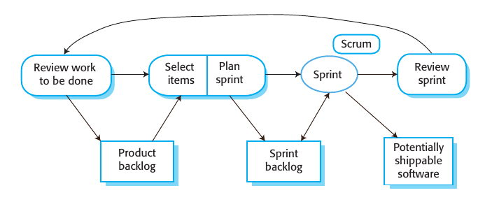

# Ingegneria del software
## 01 - Introduzione
Software molto importante al giorno d'oggi per economie e società. Addirittura le nazioni vi dipendono. Però non è **tangibile** quindi complesso e difficile da mantenere.

SW *engineering* porta **teoria**, **metodi** e **strumenti** per fare sviluppo SW in modo professionale. "Ingegneria" significa produrre prodotto della **qualità** richiesta (e non oltre) nei **tempi** e nei **budget** fissati. Accompagna il SW dalla nascita fino alla fine della manutenzione.

Costo sviluppo $<$ Costo manutenzione. SW engineering vuole essere cost-effective.

Report del 2017: solo 29% dei progetti hanno rispettato deadline e budget.

Problemi comuni:
- Progetto cancellato
- Fuori deadline
- Fuori budget
- Non tutte le feature
- SW bassa qualità
- Utenti insoddisfatti

Scuse:
- Complessità intrinseca del problema
- Ostacoli tecnologici

Vere ragioni:
- Dialogo stakeholder $\leftrightarrow$ sviluppatori
- Difficoltà capire problemi degli utenti
- Difficoltà capire dominio
- Problemi di management e organizzazione del lavoro
- Problemi team working

## 02 - Software Process
Processo SW = **Insieme strutturato di attività** da compiere per sviluppare un SW.

Per ogni attività si specificano:
- Descrizione
- Output
- Ruoli e responsabilità delle persone coinvolte
- Pre/Post-condizioni

Perché seguire un processo? Per rendere sviluppo:
- Ordinato
- Controllabile
- Ripetibile

Al fine di:
- Aumentare qualità SW (cioè **qualità processo si traduce in qualità prodotto**)
- Aumentare produttività

Vari processi ma tutti includono queste attività **standard**:
- Specifica
- Design & Implementazione
- Validazione
- Evoluzione

_Le attività_ di un processo vengono _pianificate_ secondo un mix di queste management techniques:
- Plan Driven: si pianifica tutto subito e poi si inizia il processo SW tracciando progresso
- Agile (SCRUM): si pianifica mano a mano che il processo prosegue. Più facile reagire a cambiamenti

Pianificazione delle attività $\neq$ Specifica del prodotto (cioè requisiti)

Vediamo alcuni _modelli_ di processi, ogni processo _reale_ prende aspetti da >1 di questi.

### Alcuni processi
Nel **Code & Fix** si va per tentativi. Nessuna fase di analisi o design, si va dritti all'implementazione. Alla fine si controlla se è ok altrimenti si fixa il codice e repeat. Non considerato un vero processo.

---

Il **Waterfall** è sempre **Plan Driven**. Specifica del prodotto e poi sviluppo, niente interlacciamento. Stampo industriale e manifatturiero. Output attività $i$ = Input attività $i+1$ e output freezati una volta all'attività $i+1$.

Le attività sono:
1. Raccolta e definizione requisiti
2. Design
3. Implementazione e test di ogni componente in isolamento
4. Integrazione e test dei componenti insieme.
5. Consegna al cliente e manutenzione.

Pros & Cons:
+ $+$ Enfasi su analisi requisiti e design fatti bene, implementazione lasciata per ultima
+ $+$ Disciplinato
+ $-$ Funziona solo se requisiti sono chiari e stabili
+ $-$ Difficile accomodare cambi ai requisiti. Visto che sono l'output della prima attività e tutti output sono freezati.

Buono per:
- Embedded, cambi al HW difficili e costosi
- Sistemi critici, serve tanta analisi e tutto documentato
- Organizzazioni grandi e complesse

---

**Sviluppo Incrementale** ha attività di specifica, sviluppo e validazione interlacciate. SW consegnato per incrementi. Pianificazione delle attività stesse può essere **Plan Driven oppure Agile**.

Pros & Cons:
- $+$ Costi ridotti per reagire ai cambiamenti
- $+$ Rapidissima consegna delle feature essenziali, cliente inizia subito ad usare il SW
- $+$ Maggiore feedback dagli stakeholder che usano subito il SW, requisiti per successivi incrementi saranno presi con maggiore consapevolezza
- $+$ Minore rischio di fallimento
- $-$ Difficile tracciare progresso (anche quando pianificazione è plan driven) perché si reagisce ai cambiamenti
- $-$ Costoso produrre continuamente documentazione
- $-$ Codice si sporca con il tempo e diventa sempre più costoso fare modifiche. Serve refactoring ogni tanto
- $-$ Specifica fatta poco per volta, in alcuni domini però deve fare parte del contratto iniziale
- $-$ Alcune funzionalità base sono usate da tanti componenti, ma questi ultimi saranno definiti molto più avanti nel tempo e non siamo sicuri che i componenti base (sviluppati subito) esporranno ad essi un interfaccia corretta

---

**Integrazione e Configurazione** = prendere, adattare, configurare e integrare componenti esistenti. Può essere **Plan Driven oppure Agile**.

Attività:
- Raccolta e specifica requisiti **essenziali**, **poco dettaglio**
- Ricerca e valutazione componenti
- Raffinamento requisiti alla luce dei componenti trovati. Se non è possibile modificare requisiti per essere compatibili con componenti trovati, se ne cercano altri (fase precedente)
- 
    + Configurazione componente all-in-one
    + Adattamento componenti esistenti e sviluppo di nuovi, poi integrazione

Pros & Cons:
- $+$ Basso costo di soldi e tempo
- $+$ Basso rischio
- $+$ Poco sviluppo from scratch
- $-$ Bassa qualità
- $-$ Compromissione requisiti, rischio insoddisfazione cliente
- $-$ Scarso controllo su evoluzione componenti terze parti

### Le attività standard nel dettaglio
Nella **Specifica** si capiscono e definiscono le funzionalità e i vincoli del prodotto, e i vincoli di sviluppo. Output è documento dei requisiti. Errori in questa fase molto costosi.

Opzionalmente preceduta da breve e cheap studio di fattibilità per decidere se proseguire con un analisi più dettagliata.

1. **Requirements elicitation and analysis**: osservare sistemi esistenti e parlare con cliente per produrre una **descrizione del sistema** da sviluppare. Possibilità di fare prototipi per capire meglio.
2. **Requirements specification**: **produrre un documento** che contiene i requisiti definiti formalmente. Requisiti sono due tipi: User (semplici da leggere, alto livello), System (dettagliati).
3. **Requirements validation**: controllo che requisiti siano realistici, _consistenti_ e _completi_ (ci siano tutti) altrimenti modifico il documento.

---

- **Design**: tradurre specifica in descrizione struttura SW, modelli dati, interfacce tra componenti.
    - **Design architettura**. Overall structure of SW, componenti e relazioni tra di loro
    - **Design db**
    - **Design interfacce**. Come comunicano i componenti. Con una interfaccia precisa, i componenti possono essere utilizzati senza conoscere l'implementazione e possono essere sviluppato in isolamento.
    - **Selezione e design componenti**. Cerco componenti esistenti e pianifico modifiche necessarie, oppure design componenti da creare da zero.
- **Implementazione**: tradurre design in SW.

Le due fasi possono essere interlacciate. Cambiano molto da progetto a progetto, a seconda del dominio (ad esempio un progetto embedded probabilmente non avrà db design)

---

**Validazione** è controllare che SW rispetti requisiti. Controlli manuali oppure test con dati. Test case derivanti dalla specifica iniziale.

1. Component testing, in isolamento. Test case scritti da stesse persone che hanno sviluppato componente. Automatici (unit testing). Già fatto anche durante implementazione di solito.
2. System testing, integro tutti componenti e testo sistema per intero.
3. Acceptance testing, fatto dal cliente stesso con dati realistici. Fa emergere omissioni nella specifica.

Nel processo waterfall in particolare (plan driven) testing potrebbe essere secondo modello a V, rispecchia le varie attività del processo stesso:

---

**Evoluzione** modifica SW per adattarsi ai cambiamenti del business.

- **Change anticipation**: accorgersi in fretta di possibili cambiamenti futuri, prima che diventino troppo costosi da risolvere (più si aspetta e più il SW evolve ed è difficile da modificare).
- **Change tolerance**: processo fatto in modo da accomodare cambiamenti.

Metodi:
- **Prototipi**. Durante fare di **specifica** per facilitare raccolta e specifica requisiti. Oppure durante **design** per esplorare soluzioni diverse.
- **Consegna incrementale**. Vedi il processo incrementale. Non posso fare consegna incrementale senza un processo incrementale e viceversa, sono un po' sinonimi.

## 03 - Agile
Storicamente, la maggior parte dei SWs erano grandi, molto longevi e richiedevano specifiche precise. Poi (fine anni 90) sviluppo rapido, poco overhead nel processo SW e adattamento a requisiti incompleti, imprecisi o mutabili sono diventati aspetti più importanti.

Agile è una filosofia di sviluppo software. La vediamo applicata ad un processo SW che regola e caratterizza le attività di specifica, design, implementazione e validazione. Dopo vedremo SCRUM, una tecnica di project management che segue la filosofia agile ma la applica alla fase di pianificazione del processo stesso.

(Lo il processo agile è il processo incrementale visto in precedenza, ma esteso e più dettagliato)

Principi:
- Specifica, design, implementazione e testing sono interlacciati
- Consegna incrementale (2,4 settimane)
- Coinvolgimento cliente durante il processo. Fornisce e prioritizza i requisiti, decidendo anche quali includere nel prossimo incremento. Valuta il SW mano a mano che è consegnato e fornisce feedback
- Valorizzare skill del team, lasciando che proceda a modo suo senza forzare un processo rigido
- Flessibilità, aspettarsi cambiamenti quindi sviluppare sistema in modo da accoglierli
- Semplicità, sia nel prodotto che nel processo
- Ridotta documentazione
- Estensivo utilizzo di tool di supporto e automatizzazione

Agile manifesto:
- Persone e interazioni umane $>$ processi e strumenti
- SW funzionante $>$ documentazione
- Collaborazione con cliente $>$ negoziazione con cliente
- Flessibilità $>$ rispettare il piano

Applicabilità:
- Prodotto medio-piccolo
- Cliente disponibile ad essere coinvolto
- Pochi vincoli esterni
- Sviluppo agile allacciato ad un management agile

Extreme programming, spinge lo sviluppo _iterativo_ all'estremo:
- Versioni buildate molto spesso
- In ogni build, _tutti_ i test sono _eseguiti_ e devono _passare_, anche solo per condividere il codice con un collega
- Incremento consegnato ogni 2 settimane
- On-site customer
- CI/CD
- Pair programming
- TDD
- Refactoring

---

**User story** = Storiella che racconta un **bisogno del cliente**

**Task card** = Estratte dalle user story. Il team stima effort e risorse necessarie per ogni card. Il cliente le prioritizza e decide quali fare per il prossimo incremento. Difficile capire se sono state raccolte tutte le task card essenziali per un MVP.

Si usano User Story e Task Card al posto del documento dei requisiti che invece è poco intuitivo e difficile da modificare.

---

**Test Driven Development** = Test case, strettamente legati ai requisiti (in particolare, scenari), sono scritti prima del codice ed eseguiti _automaticamente durante_ lo sviluppo. Vengono definiti con l'aiuto del cliente e validati da esso.

**Refactoring** fatto quando si vede una chance di migliorare la qualità del codice, anche se non immediatamente necessario. Serve perché qualità deteriora andando avanti a fare modifiche locali.
- Riorganizzazione classi e package
- De-duplicazione
- Estrazione funzioni
- Rinominazione attributi e funzioni

Pair Programming = Due sviluppatori allo stesso PC. Coppie create dinamicamente e cambiate di tanto in tanto. Vantaggi:
- Collective ownership, gli sviluppatori si sentono responsabili dell'intera codebase e ci tengono alla sua qualità
- Code review implicita e informale
- Refactoring incoraggiato
- Condivisione della conoscenza implicitamente
- Non necessariamente inefficiente, evidence shows

---

Ora applichiamo la filosofia agile per fare project management, cioè la pianificazione del processo di sviluppo SW. La chiamiamo SCRUM e si contrappone alla metodologia di pianificazione Plan-Driven.

Secondo SCRUM, lo sviluppo avviene secondo queste fasi:
1. **Fase iniziale**: specifica iniziale del prodotto e design di architettura SW base
2. Serie di sprint, ogni sprint produce incremento
3. **Fase finale**: si completa il SW e si scrive documentazione

Terminologia:
- Product backlog: cose da fare. Le prime task si aggiungono nella fase iniziale dello SCRUM e poi vengono aggiunte mano a mano
- Sprint: periodo di sviluppo di 2-4 settimane
- Sprint backlog: cose da fare nello sprint corrente
- Scrum: meeting giornaliero
- Velocity: quante cose il team riesce a fare in uno sprint
- ScrumMaster: persona all'interno del team che verifica che SCRUM sia rispettato
- ProductOwner: cliente partecipa indicando requisiti, prioritizzandoli e fornendo feedback

Un singolo sprint funziona così:

- Product owner dice quali task dal product backlog sarebbero più prioritarie
- Team decide quali task riesce a fare in questo sprint (anche usando la velocity stimata negli sprint precedenti) e le mette nello sprint backlog
- Sprint. Durata fissa. Team isolato dal cliente che parla solo attraverso lo scrum master. Meeting giornalieri (scrums) molto brevi (10 minuti) in cui i membri del team si scambiano informazioni:
    - Cosa ho fatto ieri
    - Cosa faccio oggi
    - Difficoltà incontrate
- Alla fine dello sprint si dice come è andata e come migliorare

Benefici:
- Delivery on-time e quindi maggiore fiducia del cliente che è più incline a fornire feedback
- Maggiore visibilità dello stato del progetto, rispetto ad un processo di sviluppo agile privo di management di qualsiasi tipo

È importante che la comunicazione tra membri del team e con il cliente sia efficacie e rapida. Se si fa da remoto, bisogna dotarsi di strumenti per comunicare.

---

Come scalare Agile per progetti più grandi o longer lasting oppure a team più grandi o distribuiti?

Scaling up = Un team più grande
Scaling out = Più team

Quando si scala Agile, bisogna continuare a seguire i principi fondamentali:
- Pianificazione flessibile
- Release frequenti
- CI/CD
- TDD
- Buona comunicazione

Agile non funziona benissimo per la **manutenzione** di progetti long-lasting:
- Enfasi su poca documentazione
- Membri del team che vanno via causano perdita di conoscenza
- Cliente potrebbe non essere disponibile a rimanere coinvolto

Quindi uso agile o plan driven se devo scalare?
- Necessario avere specifica dettagliata prima di implementare? $\rightarrow$ Plan-Driven
- Consegna incrementale fattibile? $\rightarrow$ Agile
- Quanto grande è il progetto? Se può essere sviluppato da un piccolo team locale $\rightarrow$ Agile altrimenti $\rightarrow$ Plan-Driven

---

Riassumendo, i problemi o valutazioni da fare prima di usare Agile:
- Sistema
    - Quanto grande è il progetto e il team che lo sviluppa?
    - Il progetto richiede tanta analisi e design dettagliato?
    - Qual è la longevità del progetto?
    - Il progetto è soggetto a regolamentazioni esterne?
- Team
    - Quanto le tecnologie (linguaggi/framework) si prestano ad un utilizzo agile
    - Quanto skillati sono i membri del team
    - Il team è distribuito? Se si, potrebbe essere necessario scrivere tanta documentazione
- Organizzazione
    - Il contratto richiede una specifica dettagliata
    - L'organizzazione, e la sua cultura, accoglie bene lo sviluppo agile?
    - Il cliente accetta di essere coinvolto?

---

IBM propone Agility at Scale Model (ASM) per scalare. Si usa una struttura a cipolla:
- Core agile: Piccolo team lavora in modo pienamente agile sulle feature essenziali e sviluppate per prime
- Disciplined agile delivery: feature secondarie sviluppate in un agile un po' più disciplinato
- Agility at scale: tutto il resto si sviluppa su larga scala (team grandi e distributi) in modo ancora più disciplinato

---

Multi-team scrum. Tanti team usano scrum, li mettiamo anch'essi in comunicazione con una metodologia scrum. 
- Ogni team ha un Product Owner e uno Scrum Master. 
- Ogni team ha un Software Architect, tra di loro comunicano per definire la struttura completa del sistema. 
- Le deadline degli sprint sono allineati.
- Scum of scrums. Un rappresentante da ogni team partecipa ad uno scrum inter-team.

---

Resistenze a metodologie agili:
- Project manager senza esperienza in agile riluttanti a correre il rischio
- Grandi organizzazioni richiedono controlli di qualità e standard rigidi
- Agile richiede sviluppatori tanto skllati
- Resistenza culturale, diffidenza, conservatorismo

# 04 - Requisiti

# 05 - Architettura
